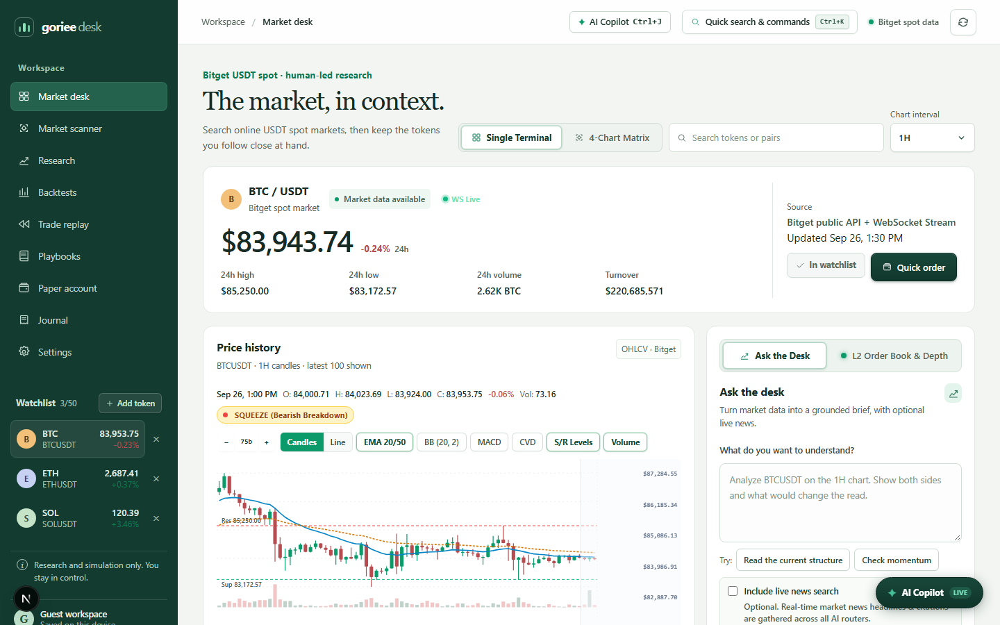

# Goriee AI Desk

A research-first trading desk prototype for the Bitget AI Base Camp Hackathon. It fetches public Bitget spot market data, calculates indicators on the server, and records paper trades in the browser. It does not place live orders.



## Contents

- [What this is (and what it is not)](#what-this-is-and-what-it-is-not)
- [Workspace tour](#workspace-tour)
- [Tech stack](#tech-stack)
- [Run locally](#run-locally)
- [Configuration](#configuration)
- [AI Providers & Model Switching Guide](#ai-providers--model-switching-guide)
- [Project structure](#project-structure)
- [API routes](#api-routes)
- [Browser data storage](#browser-data-storage)
- [Testing](#testing)
- [Screenshots](#screenshots)
- [Limitations and disclaimers](#limitations-and-disclaimers)
- [Related documentation](#related-documentation)

## What this is (and what it is not)

**It is:** a single-page trading research terminal that combines live Bitget public market data (REST plus WebSocket), server-side indicator math, LLM-driven research briefs, a natural-language backtester, a trade replay studio, and a paper trading ledger stored in your browser.

**It is not:** an exchange client. The app never touches private Bitget API keys, never signs requests, and never submits real orders. Every position, fill, and balance you see is simulated locally.

## Workspace tour

The app is organized into nine workspaces, reachable from the sidebar on desktop, an icon rail on tablet, and a bottom navigation bar with a "More" sheet on mobile.

| Workspace | What you can do there |
|---|---|
| **Market desk** | Search online Bitget USDT spot pairs (including tokenized RWA assets). Interactive candlestick/line chart with OHLCV crosshair inspection, EMA 20/50 overlays, Bollinger Bands (20, 2), MACD (12, 26, 9), support/resistance levels, volume bars, a CVD order-flow oscillator, a volatility squeeze radar, an L2 order book depth ladder, and a 4-chart multi-timeframe matrix. |
| **Market scanner** | Sort live tickers by 24h change or turnover, filter by asset type (Crypto vs. Tokenized), search, and jump straight to Desk, AI Brief, or Backtest for any row. Add markets to the watchlist in one click. |
| **Research** | Write a hypothesis, attach live market context (ticker snapshot, indicator pre-flight with RSI meter, 24h range, EMA alignment, S/R envelope), and generate an AI brief grounded in Bitget ticker data and completed candles. Reports include bull/bear theses, invalidation levels, optional live news search, Markdown export, and a shareable strategy card PNG. Four strategy lenses are available (Elliott Wave, Wyckoff, SMC & Liquidity, Quant Confluence). |
| **Backtests** | Describe a strategy in plain language; an LLM compiles it into a deterministic rule set (EMA crossover and RSI mean reversion families) with a 15-second fallback race. Runs replay historical Bitget candles with configurable fees/slippage and sampled order book spread. Outputs: dual equity curve vs. buy & hold, in-sample/out-of-sample walk-forward cards, Institutional Credibility Scorecard (alpha, retention decay, breakeven fee ceiling), Monte Carlo equity cone, a 2D parameter sensitivity heatmap with overfitting detection (robust plateau vs. fragile cliff), and a full simulated trades ledger. |
| **Trade replay** | Replay historical tape candle by candle with zoom/pan, a click-to-cut tape bar, playback transport controls, TP/SL/Mark brackets, [2R]/[3R]/[BE] quick snaps, discretionary order entry, and an end-of-session performance scorecard. |
| **Playbooks** | Save, search, and filter your strategy library. Three institutional starter templates are included. Deploy any playbook to the paper account ("Use in Paper") or send it to the backtest lab. An optional rule runner evaluates active playbook rules against live candle closes and logs simulated fills to an execution audit log. |
| **Paper account** | $10,000 virtual starting balance. Six account summary cards, an open positions table with TP/SL/trailing bracket pills, a Daily Loss Guard with capacity bar, price and risk alerts, and a simulated order ticket with capital presets (25%, 50%, 75%, Max), concentration alerts, and a dynamic Kelly sizer. Sub-tabs: Account, Trade Review (cumulative realized P&L curve, metrics, CSV export), and Analytics (Sharpe/Sortino/Calmar, expectancy, drawdown waterfall, rolling win rate, allocation donut, daily P&L calendar heatmap, streak tracking). |
| **Journal** | Saved research briefs with market snapshots and indicator history, a KPI strip, and a master-detail split layout for instant inspection without dialogs. |
| **Settings** | Six provider presets (NVIDIA NIM, OpenRouter, OpenAI, Claude, UnoRouter, Custom), a round-trip connection ping with latency readout, and a local storage privacy notice. |

Global extras: a Bloomberg-style command palette on `Ctrl+K` / `Cmd+K` (navigation, quick actions, live market search, and a natural-language position sizing calculator like `risk $250 2%`), live WebSocket ticker flashes with polling fallback, and workspace backup/restore for all local data.

## Tech stack

| Layer | Choice |
|---|---|
| Framework | Next.js 16.3.6 (App Router, Turbopack) |
| UI | React 19.3.0, TypeScript 7, vanilla CSS design system (no component library) |
| Market data | Bitget public spot REST API and `wss://ws.bitget.com/v2/ws/public` |
| AI | Any OpenAI-compatible chat completions endpoint, configured at runtime |
| Charts | Hand-built SVG/HTML charts (no charting dependency) |
| Testing | `node --test` plus Puppeteer-core driving headless Chrome |
| Storage | Browser localStorage only; no database, no accounts |

## Run locally

### Prerequisites

- Node.js 20.9 or later (Next.js 16 requirement)
- npm
- Network access to Bitget's public API for live market data
- Google Chrome installed for the E2E suites (Puppeteer-core attaches to a local Chrome)

### Start

```bash
npm install
npm run dev
```

Open [http://localhost:3000](http://localhost:3000). Public market data requires no Bitget API key, and the core desk, scanner, paper account, and replay features work without any AI configuration.

### Enable AI features (optional)

To enable AI research, the Strategy Copilot, and natural-language backtest rules, copy `.env.example` to `.env.local` and set an OpenAI-compatible chat completions endpoint:

```bash
LLM_BASE_URL=https://api.openai.com/v1
LLM_API_KEY=your-key
LLM_MODEL=your-model
```

The API key is read only by server routes and is never sent to the browser. Do not paste it into the chat UI or commit `.env.local`. Providers can also be switched at runtime from the Settings workspace.

## Configuration

| Variable | Where | Purpose |
|---|---|---|
| `LLM_BASE_URL` | `.env.local` | Base URL of an OpenAI-compatible chat completions endpoint. Required for AI research and natural-language backtests. |
| `LLM_API_KEY` | `.env.local` | Server-side API key. Never exposed to the browser. |
| `LLM_MODEL` | `.env.local` | Model name passed to the endpoint. |
| `GORIEE_TEST_BASE_URL` | test runs | Overrides the base URL that `test/api.test.mjs` targets (default: `127.0.0.1:3000`, auto-started if nothing is listening). |
| `GORIEE_RUN_LIVE_AI_TESTS=1` | test runs | Opt-in flag that enables the live LLM research test, which calls a real paid provider. Skipped by default. |

## AI Providers & Model Switching Guide

Goriee AI Desk supports any OpenAI-compatible or Anthropic chat completion model (DeepSeek, Claude, GPT-4o, NVIDIA NIM, or 100% private local Ollama inference) for its Strategy Compiler, Market Research Engine, and Strategy Copilot.

### 1. How to Switch Models

#### Method A: In-Browser GUI (Zero Restart)
1. Open the application at [http://localhost:3000](http://localhost:3000).
2. Click **Settings** in the left sidebar navigation.
3. Select an AI Provider preset (**OpenRouter**, **NVIDIA NIM**, **OpenAI**, **Claude**, or **Custom Router**).
4. Enter your **API Key** (or use `ollama` for local inference).
5. Click **Save provider settings**, then click **Test connection / Ping** to verify latency.

#### Method B: Direct `.env.local` Configuration
Set the configuration keys in `.env.local`:
```bash
LLM_BASE_URL="https://openrouter.ai/api/v1"
LLM_MODEL="deepseek/deepseek-r1"
LLM_API_KEY="sk-or-v1-..."
```
The Next.js dev server hot-reloads these environment variables automatically.

---

### 2. Supported AI Providers & Endpoint Matrix

| Provider | Base URL (`LLM_BASE_URL`) | Recommended Model ID (`LLM_MODEL`) | Best For | Tier / Cost |
| :--- | :--- | :--- | :--- | :--- |
| **OpenRouter** | `https://openrouter.ai/api/v1` | `deepseek/deepseek-r1`<br>`meta-llama/llama-3.3-70b-instruct`<br>`anthropic/claude-3.5-sonnet` | Broadest model access, live web citations, auto-fallback | Free models available; pay-per-token for top tiers |
| **DeepSeek (Direct)** | `https://api.deepseek.com/v1` | `deepseek-chat` (V3)<br>`deepseek-reasoner` (R1) | Complex reasoning & low token cost | ~$0.14 - $0.55 per 1M tokens |
| **OpenAI** | `https://api.openai.com/v1` | `gpt-4o-mini` (Fastest)<br>`gpt-4o` (Flagship) | Reliable structured JSON outputs, ultra-fast response | Developer API billing |
| **Anthropic Claude** | `https://api.anthropic.com/v1` | `claude-3-5-haiku-20241022`<br>`claude-3-5-sonnet-20241022` | Deep quantitative reasoning & complex conditional rules | Commercial API token billing |
| **NVIDIA NIM** | `https://integrate.api.nvidia.com/v1` | `meta/llama-3.3-70b-instruct`<br>`z-ai/glm-5.3` | High-throughput enterprise MoE inference | 1,000 free credits upon sign-up |
| **Local Ollama** *(Private)* | `http://localhost:11434/v1` | `deepseek-r1:14b`<br>`qwen2.5-coder:14b`<br>`llama3.1:8b` | Complete offline privacy, zero API costs | 100% Free (runs locally on GPU/CPU) |
| **LM Studio / vLLM** | `http://localhost:1234/v1` | Local loaded model name | Local testing with GUI controls | Free local server |

---

### 3. Model Recommendations by Workspace Function

- **Quantitative Backtest Strategy Compiler** (translates natural language into deterministic execution rules):
  - *Top Choice*: `deepseek/deepseek-r1` or `deepseek-reasoner` — Reasoner models chain thought tokens to guarantee all indicator bounds and exit thresholds match the prompt exactly.
  - *Speed Choice*: `gpt-4o-mini` — Sub-second latency, deterministic structured JSON output.
  - *Benchmark Pick*: `claude-3-5-sonnet-20241022` — Deep accuracy on multi-timeframe rules.
- **Strategy Copilot** (real-time trading assistant, order book imbalance analysis, Kelly sizing):
  - *Top Choice*: `gpt-4o-mini` or `claude-3-5-haiku-20241022` — Instant response latency during live market observation.
- **Bullish / Bearish Market Research Engine** (macro context, indicator confluence, invalidation levels):
  - *Top Choice*: `openrouter.ai` with any modern model — Seamlessly bundles live web search citations.

---

### 4. Step-by-Step Provider Setup Guides

#### DeepSeek (via OpenRouter or Direct API)
- **Via OpenRouter**: Obtain a key at [openrouter.ai](https://openrouter.ai). In Settings, select **OpenRouter**, set Model ID to `deepseek/deepseek-r1` (or `deepseek/deepseek-chat`), enter your key, and click **Save**.
- **Via DeepSeek Direct**: Generate an API key at [platform.deepseek.com](https://platform.deepseek.com). In Settings, select **Custom Router**, set API base URL to `https://api.deepseek.com/v1`, Model ID to `deepseek-chat`, and paste your key.

#### OpenAI (GPT-4o / GPT-4o-mini)
- Generate a developer key at [platform.openai.com/api-keys](https://platform.openai.com/api-keys).
- In Settings, select **OpenAI API · ChatGPT models**. Model ID defaults to `gpt-4o-mini` (or enter `gpt-4o`), paste your key, and click **Save**.

#### Anthropic Claude
- Generate an API key at [console.anthropic.com](https://console.anthropic.com).
- In Settings, select **Claude API · Anthropic**. Model ID defaults to `claude-3-5-haiku-20241022` (or `claude-3-5-sonnet-20241022`), paste your key, and click **Save**.

#### 100% Free & Private Local AI (Ollama)
Run state-of-the-art models completely on your own machine without sending data to external servers:
1. Install Ollama from [ollama.com](https://ollama.com).
2. Pull and run a model:
   ```bash
   ollama run deepseek-r1:14b
   # or for lightweight machines:
   ollama run qwen2.5:7b
   ```
3. In Goriee Desk Settings, select **Custom Router**:
   - **Base URL**: `http://localhost:11434/v1`
   - **Model ID**: `deepseek-r1:14b` (or your chosen model)
   - **API Key**: `ollama` (placeholder)
4. Click **Save provider settings**, then click **Test connection / Ping**!

---

### 5. Verification & Diagnostics

#### Test Connection in UI
In **Settings**, click **Test connection / Ping** in the top right:
- **Success**: Displays green banner with round-trip latency (e.g. `Active connection verified (185ms)`).
- **Failure**: Displays descriptive error banner with root cause (invalid key, unreachable host, or rate limit).

#### Test Connection via Command Line
```powershell
node -e "fetch('http://localhost:3000/api/ai-status').then(r=>r.json()).then(console.log)"
```

#### Troubleshooting Reference

| Symptom | Cause | Solution |
| :--- | :--- | :--- |
| **"AI is not configured"** | Missing API key or base URL in `.env.local` | Open **Settings** in the browser, choose a preset, paste your key, and click Save. |
| **"Daily quota exceeded / 429"** | Provider free-tier rate limits reached | In Settings, switch to a paid API key or use local Ollama / LM Studio. |
| **"Invalid JSON object returned"** | Model generated conversational prose around JSON | Ensure your model supports system prompts and JSON mode. DeepSeek, GPT-4o, and Claude natively adhere to strict schemas. |
| **401 Unauthorized** | Expired or incorrect API key | Re-copy key directly from provider's developer dashboard and re-save in Settings. |
| **High Latency (> 5s)** | Large reasoning models thinking through proofs | Switch to a faster model like `gpt-4o-mini`, `qwen2.5:14b`, or `claude-3-5-haiku`. |

## Project structure

```
src/
  app/               # Next.js App Router: layout, page, error boundaries, OG image
    api/             # 11 server route handlers (see API routes below)
  components/        # React components: trading-desk.tsx (main shell), price-chart.tsx,
                     #   orderbook-panel.tsx, strategy-copilot.tsx, command-palette.tsx,
                     #   parameter-heatmap.tsx, portfolio-analytics.tsx, replay HUD, ...
  styles/            # Modular stylesheets (tokens, shell, components, charts, workspaces)
  lib/               # Server + shared logic: bitget.ts (REST & indicators), bitget-ws.ts,
                     #   backtest.ts, monte-carlo.ts, parameter-matrix.ts, kelly-sizer.ts,
                     #   order-flow.ts, orderbook.ts, paper-accounting.ts, replay-engine.ts,
                     #   portfolio-analytics.ts, rule-runner.ts, llm.ts, safe-storage.ts,
                     #   workspace-backup.ts, rate limiting and error handling helpers
  types/             # Shared TypeScript types
test/                # node:test suites (unit, API, E2E) plus verification scripts
  screenshots/       # High-resolution captures produced by test runs
docs/                # Intent notes and specs (reliability & safeguards)
screenshots/         # Viewport captures used in this README
```

## API routes

All routes are server-side. Market routes proxy and normalize Bitget public endpoints; AI routes call the configured LLM provider with the key held on the server.

| Route | Purpose |
|---|---|
| `GET /api/market` | Candle and ticker data for a single market. |
| `GET /api/market/confluence` | Multi-horizon (15m, 1H, 4H, 1D) trend confluence aggregation. |
| `GET /api/tickers` | Live ticker list for the desk and watchlist. |
| `GET /api/scanner` | Ranked market scanner feed (change, turnover, asset type). |
| `GET /api/orderbook` | L2 order book snapshot, spread and imbalance. |
| `GET /api/tokens` | Tokenized asset (RWA) metadata. |
| `POST /api/research` | AI research brief grounded in ticker data, completed candles, and calculated indicators. |
| `POST /api/backtest` | Natural-language strategy compilation and candle replay. |
| `POST /api/copilot/chat` | Strategy Copilot chat turns. |
| `GET /api/settings` | Server-side provider configuration status. |
| `GET /api/ai-status` | AI availability and rate-limit status for the UI. |

## Browser data storage

All user state lives in localStorage under versioned keys. Nothing is sent to a server, and the workspace backup feature covers every key below (round-trip tested in `test/workspace-backup.test.mjs`).

| Key | Contents |
|---|---|
| `goriee.watchlist.v1` | Watched symbols (max 50). |
| `goriee.playbooks.v1` | Saved strategy playbooks (max 30). |
| `goriee.active-paper-playbook.v1` | ID of the playbook deployed to the paper desk. |
| `goriee.paper.v1` | Paper trade ledger (fills, closes, fees). |
| `goriee.paper-brackets.v1` | TP/SL/trailing bracket orders. |
| `goriee.paper-alerts.v1` | Price, stop, and target alerts (max 50). |
| `goriee.paper-risk.v1` | Daily loss guard limit in USD (default 250). |
| `goriee.journal.v1` | Saved research briefs. |
| `goriee.auto-rule-runner.v1` | Automated rule runner on/off flag. |
| `goriee.rule-runner-logs.v1` | Automated execution audit log. |
| `goriee_copilot_sessions_v1` | Strategy Copilot chat threads. |

## Testing

The repository ships an automated multi-tier suite built on `node:test`.

```bash
# Unit, math, and API integration tests (fast)
npm test

# Unit/math only, without the API suite
npm run test:unit

# Headless Chrome end-to-end tests (general UI + Strategy Copilot)
npm run test:e2e

# Everything above in one run
npm run test:all

# Trade Replay Studio E2E (separate suite)
node --test test/trade-replay-e2e.test.mjs

# Console error audit: visits every tab and asserts zero runtime JS errors
node test/check-console-errors.mjs

# Typecheck and production build
npm run typecheck
npm run build
```

What each tier covers:

- **Unit & math** (`test/unit.test.mjs`): EMA, RSI, ATR, Bollinger, MACD, sizing presets, cumulative P&L, CSV export, research-to-backtest prompt generation, playbook rule evaluation, parameter matrix robustness scoring, order flow CVD, Kelly sizing, squeeze detection.
- **Quant & order book** (`test/monte-carlo-orderbook.test.mjs`): spread/imbalance math, 500-run Monte Carlo percentiles, bracket order evaluation.
- **Paper accounting & lifecycle** (`test/paper-accounting.test.mjs`, `test/bracket-lifecycle.test.mjs`): ledger arithmetic and TP/SL/trailing bracket state transitions.
- **Storage safety** (`test/safe-storage.test.mjs`, `test/workspace-backup.test.mjs`): quota handling, backup allowlist round-trip, validation, and restore.
- **Rate limiting & live status** (`test/rate-limit.test.mjs`, `test/live-status.test.mjs`).
- **HTTP layer** (`test/bitget-http.test.mjs`): Bitget client behavior and response handling.
- **API integration** (`test/api.test.mjs`): exercises the route handlers against a running dev server (auto-started if needed; requires network for Bitget public data).
- **Browser E2E** (`test/e2e.test.mjs`, `test/copilot-e2e.test.mjs`, `test/trade-replay-e2e.test.mjs`): Puppeteer-core drives headless Chrome through interactive flows (chart toggles, crosshair inspection, scanner search, backtest runs, order modal presets, trade review, replay transport, copilot chat) and writes verification screenshots to `test/screenshots/`.

The most recent recorded run (September 29, 2026, see [PROJECT_MEMORY.md](PROJECT_MEMORY.md)): 157 tests, 156 pass, 0 fail, 1 skipped (the skip is the live-AI test, opt-in via `GORIEE_RUN_LIVE_AI_TESTS=1`), and 0 TypeScript errors.

There are also many one-off `verify-*.mjs` and `inspect-*.mjs` scripts in `test/` used during development for visual checks; they are not part of the suites above.

## Screenshots

Captured from headless Chrome runs, stored in `screenshots/`:

| Viewport | Views |
|---|---|
| Desktop (1440x900) | `desktop-desk.png`, `desktop-scanner.png`, `desktop-paper-analytics.png` |
| Tablet (768x1024) | `tablet-desk.png` |
| Mobile (390x844) | `mobile-desk.png`, `mobile-scanner.png`, `mobile-paper-analytics.png`, `mobile-more-drawer.png`, `mobile-order-modal.png` |

## Limitations and disclaimers

- Market conditions, indicator values, and backtest results are for research and demonstration only. Historical performance does not predict future results. Nothing here is financial advice.
- Backtests are long-only spot simulations with configurable fee/slippage parameters and current order book spread sampling; open positions are marked at the final close.
- The paper account is a local simulation. Balances and fills persist only in your browser and are lost if you clear site data without exporting a workspace backup.
- The app never connects to a private Bitget account and never submits real orders.
- Bitget's public candle API supplies historical price data. This app runs its own transparent candle-based simulation rather than claiming to invoke private Playbook execution.
- AI features depend on a third-party LLM endpoint you configure; output quality and availability vary by provider, and the live Bitget rate limits apply to market data polling.

## Related documentation

- [docs/intent/reliability-and-safeguards.md](docs/intent/reliability-and-safeguards.md) and [docs/specs/SPEC-reliability-and-safeguards.md](docs/specs/SPEC-reliability-and-safeguards.md): reliability intent and specification.
